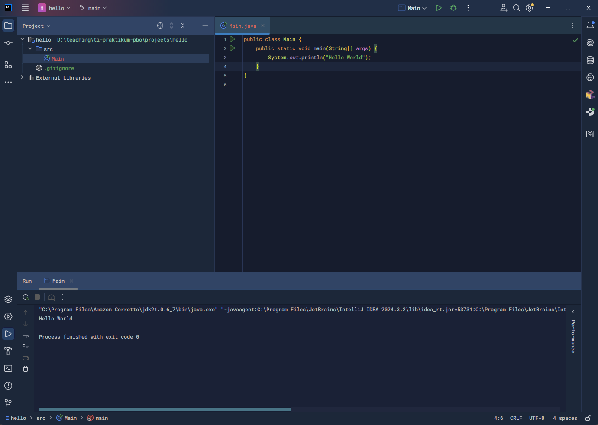

# Laporan Modul 1: Perkenalan Java dan Ekosistemnya
**Mata Kuliah:** Praktikum Pemrograman Berorientasi Objek  
**Nama:** Malikul Mulki  
**NIM:** 2024573010079  
**Kelas:** TI 2A

---

## Abstrak
Laporan ini membahas pengenalan paradigma Pemrograman Berorientasi Objek (OOP) dan alasan pemilihan Java sebagai bahasa pemrograman dalam mata kuliah Praktikum Pemrograman Berorientasi Objek. Selain itu, laporan juga menjelaskan ekosistem Java yang meliputi JDK, JRE, JVM, dan IDE, serta memberikan langkah-langkah detail instalasi Java (Amazon Corretto) di Windows. Sebagai implementasi praktikum, laporan ini menyajikan pembuatan program sederhana "Hello World" menggunakan Java.

Tujuan laporan ini adalah agar mahasiswa memahami teori dasar Java, mampu menyiapkan lingkungan pengembangan, dan dapat menjalankan program Java pertama mereka.

---

## 1. Pendahuluan

### 1.1 Pemrograman Berorientasi Objek (OOP)
Pemrograman Berorientasi Objek adalah paradigma pemrograman yang mengorganisir kode dalam bentuk **objek**. Objek memiliki:
- **Atribut (properties):** Data atau karakteristik yang dimiliki objek.
- **Method (behavior):** Aksi atau fungsi yang dapat dilakukan objek.

**Keuntungan OOP:**
1. **Modularitas:** Kode dipecah menjadi unit-unit kecil sehingga lebih mudah dipahami.
2. **Reusability:** Kode dapat digunakan kembali di berbagai proyek.
3. **Maintainability:** Struktur kode yang jelas mempermudah perawatan dan debugging.
4. **Scalability:** Aplikasi dapat dikembangkan lebih besar tanpa mengganggu struktur lama.

### 1.2 Mengapa Java?
Java dipilih sebagai bahasa untuk mata kuliah ini karena keunggulan:
- **Platform independence:** Konsep *Write Once, Run Anywhere*.
- **Strongly typed language:** Type-checking ketat saat kompilasi, mengurangi error runtime.
- **Rich library:** Perpustakaan luas untuk string, networking, database, GUI, dll.
- **Large community:** Dukungan komunitas yang besar.
- **Industry standard:** Banyak digunakan oleh perusahaan besar.

### 1.3 Ekosistem Java
Ekosistem Java terdiri dari beberapa komponen utama:
- **JDK (Java Development Kit):** Paket lengkap untuk pengembangan Java (compiler, debugger, library).
- **JRE (Java Runtime Environment):** Lingkungan runtime untuk menjalankan aplikasi Java.
- **JVM (Java Virtual Machine):** Mesin virtual yang mengeksekusi bytecode Java.
- **IDE (Integrated Development Environment):** Aplikasi seperti IntelliJ IDEA atau Eclipse.

---

## 2. Praktikum 1: Instalasi JDK (Amazon Corretto)

### 2.1 Download Amazon Corretto
1. Buka [https://aws.amazon.com/corretto/](https://aws.amazon.com/corretto/)
2. Klik **Download Amazon Corretto**.
3. Pilih versi **Amazon Corretto 17 (LTS)** atau **21 (LTS)**.
4. Pilih installer untuk **Windows x64** (`.msi`).

### 2.2 Instalasi di Windows
1. Jalankan file installer (contoh: `amazon-corretto-17-x64-windows-jdk.msi`).
2. Klik **Next** → setujui **License Agreement**.
3. Gunakan opsi default instalasi.
4. Catat **path instalasi** (contoh: `C:\Program Files\Amazon Corretto\jdk17.x.x_xx\`).
5. Klik **Install** → **Finish**.

### 2.3 Verifikasi Instalasi
Buka **Command Prompt** lalu ketik:

    java -version
Output yang diharapkan:

    arduino
    Copy code
    openjdk version "17.0.x" 2023-xx-xx LTS
    OpenJDK Runtime Environment Corretto-17.0.x.x (build ...)
    OpenJDK 64-Bit Server VM Corretto-17.0.x.x (build ..., mixed mode, sharing)
Cek compiler dengan:

Copy code

    javac -version
Output yang diharapkan:

    nginx
Copy code

    javac 17.0.x
## 3. Praktikum 2: Instalasi IntelliJ IDEA
(Bagian ini mengikuti modul_3, bisa diisi langkah-langkah instalasi IDE IntelliJ IDEA seperti pada modul_3 Praktikum 2)

## 4. Praktikum 3: Persiapan Repository Projek
### 4.1 Tujuan
Mempersiapkan repository GitHub untuk projek PBO.

Melakukan inisialisasi repository lokal dengan Git.

Melakukan cloning repository dari GitHub ke lokal.

### 4.2 Langkah-Langkah
#### a. Install Git

Jika Git belum terinstall, download di https://git-scm.com/
Cek instalasi:

Copy code
    
    git --version
Output jika berhasil:

    nginx
Copy code

    git version 2.45.0
### b. Membuat Repository di GitHub
#### Login ke GitHub.

Klik New Repository.

Nama repository:

php-template
Copy code
    
    praktikum-pbo-<NIM>
Checklist Add README file.

Klik Create Repository.

### c. Menentukan Direktori Lokal
#### Tentukan direktori projek di komputer, contoh:

Copy code

    cd /d/Kuliah/PBO
### d. Clone Repository
#### Salin URL repository dari GitHub, contoh:

Copy code

    https://github.com/username/praktikum-pbo-230101012.git
Lakukan clone:

Copy code
    
    git clone https://github.com/username/praktikum-pbo-230101012.git
Hasilnya akan terbentuk folder baru:

Copy code

    praktikum-pbo-230101012

### e. Struktur Project
#### Buat folder dan file baru di dalam repository:

Copy code

    praktikum-pbo/
    ├── .gitignore
    ├── README.md                 ← Biarkan kosong sementara
    ├── laporan/
    │   ├── laporan1/
    │   ├── laporan.md            ← Contoh laporan (format Markdown)
    │   └── gambar/
    │       └── gambar.png        ← Contoh gambar
    └── projects/                 ← Placeholder untuk ujicoba praktikum
## 5. Praktikum 4: Program Hello World Java
### 5.1 Membuat Project Baru di IntelliJ
#### Buka IntelliJ IDEA → File → New → Project.

Pilih Java SDK yang sudah terinstall.

Tentukan lokasi penyimpanan project.

Hilangkan checklist pada Create Git repository.

### 5.2 Membuat Class Main
Klik kanan folder src → New → Java Class → beri nama Main.

Isi kode:

Copy code

    public class Main {
        public static void main(String[] args) {
            System.out.println("Hello World");
        }
    }
### 5.3 Menjalankan Program
Klik tombol Run → hasil output:

Copy code

    Hello World

