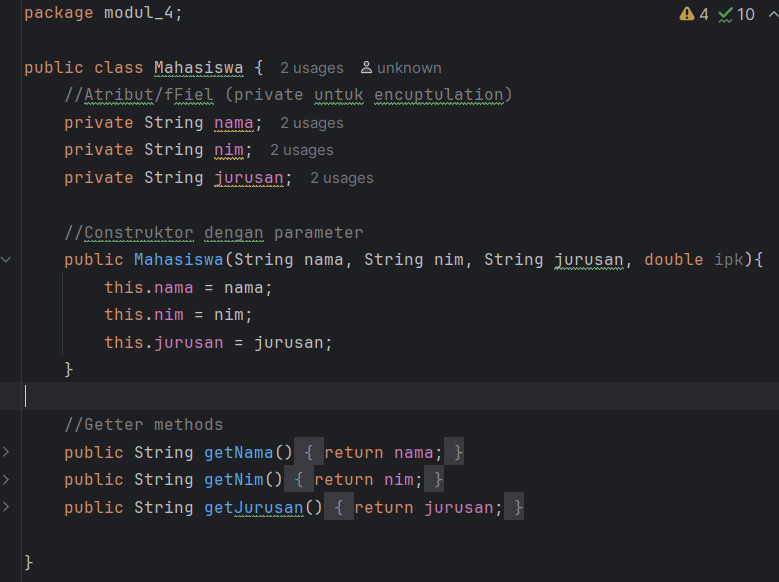
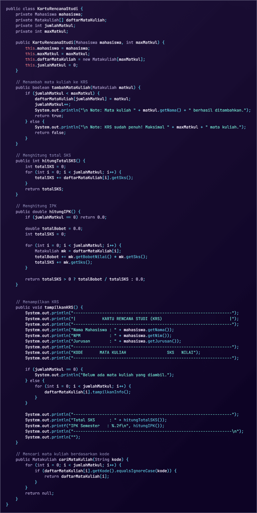
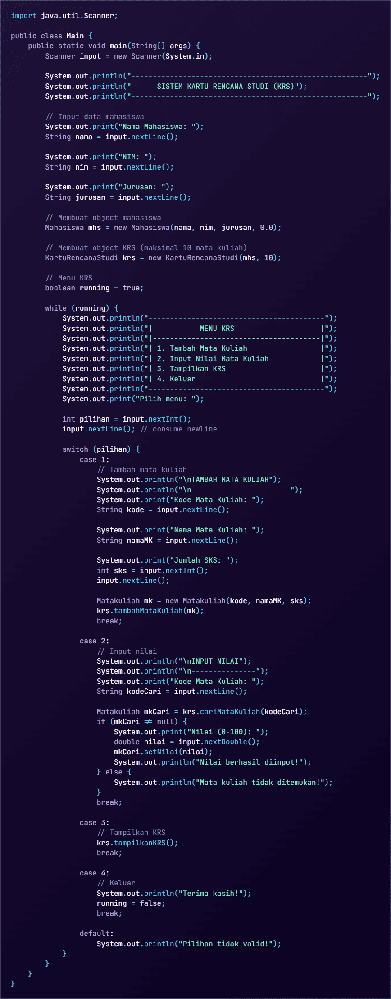

# Pengenalan Object Oriented Programming
### Pendahuluan
Modul ini dirancang untuk memberikan pemahaman dasar tentang pemrograman berorientasi objek menggunakan Java melalui praktikum langsung. Setiap praktikum dilengkapi dengan teori dasar dan langkah-langkah implementasi yang detail.

### Sebelum Memulai Praktikum
Buat sebuah package baru dengan nama modul_4 di dalam folder src, kemudian, selesaikan seluruh praktikum dan latihan dari modul ini di dalam package modul_4.
### Teori Dasar
Objek-Oriented Programming (OOP) adalah paradigma pemrograman yang menggunakan “objek” - struktur data yang berisi data, dalam bentuk field, sering kali dikenal sebagai atribut; dan kode, dalam bentuk prosedur, sering kali dikenal sebagai metode.

Inti dari OOP adalah mendesain software dengan membagi masalah menjadi serangkaian objek yang saling berinteraksi. Ini bertentangan dengan pemrograman prosedural, yang fokus pada fungsi/prosedur dalam memproses data. OOP memungkinkan kita untuk membuat kode yang lebih modular, reusable, dan mudah di-maintain.
#### Konsep Dasar OOP.
- Class: Template atau blueprint untuk membuat object
- Object: Instance dari sebuah class
- Attribute/Field: Variabel yang dimiliki oleh class
- Method: Function yang dimiliki oleh class
- Constructor: Method khusus untuk inisialisasi object
#### Prinsip OOP.
Encapsulation: Menyembunyikan detail implementasi
Inheritance: Pewarisan sifat dari class parent
Polymorphism: Kemampuan object untuk memiliki banyak bentuk
Abstraction: Menyederhanakan kompleksitas dengan menyembunyikan detail
### Class dan Objek
kelas adalah konsep abstrak yang mendefinisikan set atribut dan metode yang akan dimiliki oleh object. Kelas menyediakan struktur atau template yang menentukan bagaimana sebuah object harus dibuat. Kelas akan menentukan jenis atribut dan metode apa yang akan dimiliki oleh object, tetapi tidak menentukan nilai dari atribut itu sendiri untuk object tertentu.

Object adalah inti dari pemrograman berorientasi objek. Setiap object memiliki dua karakteristik utama, yaitu:

Object, dalam konteks pemrograman OOP, adalah sebuah entitas yang memiliki karakteristik dan perilaku. Kelas, di sisi lain, merupakan blueprint atau cetakan untuk membuat object. Kalau kamu bandingkan dengan dunia nyata, kamu bisa menganggap kelas sebagai rencana desain bangunan, sedangkan object adalah bangunan yang sesungguhnya telah dibangun berdasarkan desain tersebut.

## Praktikum : Dasar Class dan Object
#### Langkah-langkah:
1. Buat class baru bernama Mahasiswa!
2. Buat class Mahasiswa dan isikan kode berikut:
    
3. Buat class Matakuliah dan isikan kode berikut:

4. Buat class RencanaKartuStudi dan isikan kode berikut:

5. Buat class Main untuk menguji:

6. Jalankan program, kemudian lakukan ujicoba dengan berbagai input.
7. Amati bagaimana object menyimpan data, juga bagaimana method bekerja.