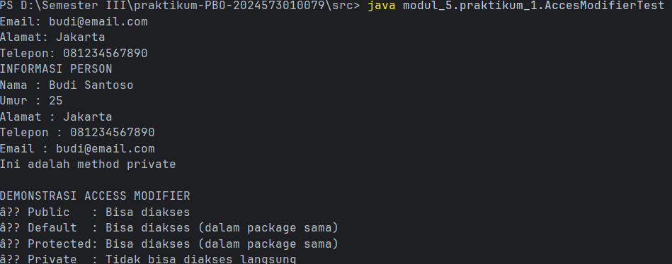

# Enkapsulasi
### Pendahuluan

Enkapsulation adalah satu prinsip fundamental dalam Object-Oriented Programming (OOP) yang membungkus data (attributes) dan method yang bekerja pada data tersebut dalam satu unit (class), serta menyembunyikan detail implementasi internal dari dunia luar.
#### Tujuan Enkapsulasi
1. Data Protection - Melindungi data dari akses dan modifikasi yang tidak sah.
2. Data Validation - Memastikan data yang masuk valid sebelum disimpan.
3. Flexibility - Mudah mengubah implementasi internal tanpa mempengaruhi kode luar.
4. Maintainability - Kode lebih mudah dipelihara dan di-debug.
5. Modularity - Membuat kode lebih modular dan terorganisir.

#### Prinsip Utama 

| Public Interface (Method yang dapat di akses publik) |
|----------------------------------------------------------|
| Pivate Inplementation                                    |
| Private Attributes                                       |
| Private Helper Methods                                   |
| Business Logic                                           |

#### Cara Implementasi
1. Deklarasikan attributes sebagai private.
2. Buat getter methods untuk membaca nilai attributes.
3. Buat setter methods untuk mengubah nilai attributes dengan validasi.
4. Tambahkan business logic di dalam class.

#### Acces Modifier:
Access modifier menentukan tingkat akses terhadap class, attributes, dan methods. Java memiliki 4 jenis access modifier: 

|Modifier| Class | Package | Subclass | Word |
|--------|-------|---------|----------|------|
| Public | Y |Y|Y|Y|
|Protected|Y|Y|Y|X|
|Default|Y|Y|X|X|
|Private|Y|X|X|X|

#### Sebelum Memulai Praktikum
Buat sebuah package baru dengan nama modul_5 di dalam folder src, kemudian, selesaikan seluruh praktikum dan latihan dari modul ini di dalam package modul_5.
## Praktikum 1: Memahami Acces Modifer
#### Tujuan:
Memahami Perbedann dan penggunaan berbagai acces modifier.
#### Langkah-langkah:
1. Buat sebuah package baru di dalam package modul_5 dengan nama praktikum_1.
2. Buat class baru bernama Person dengan berbagai access modifier.
   package modul_5.praktikum_1;

public class Person {
//Private - hanya bisa di akses dalam class ini
private String nama;
private int umur;

    //Default (package-private) -  bisa di akses dalam package yang sama
    String alamat;

    //Protected - bisa di akses dalam package dan subclass
    protected String telepon;

    public String email;

    //Constructor;
    public Person(String nama, int umur){
        this.nama = nama;
        this.umur = umur;
    }

    //Public method untuk menampilkan info
    public void tampilkanInfo(){
        System.out.println("INFORMASI PERSON");
        System.out.println("Nama : " + nama);       //ok - dalam class yang sama
        System.out.println("Umur : " + umur);       //ok - dalam class yang sama
        System.out.println("Alamat : " + alamat);   //ok - dalam class yang sama
        System.out.println("Telepon : " + telepon); //ok - dalam class yang sama
        System.out.println("Email : " + email);     //ok - dalam class yang sama
    }

    //Private method - hanya bisa di panggil dalam class ini
    private void metodePribadi(){
        System.out.println("Ini adalah method private");
    }

    //Protected method
    protected void metodeProtected(){
        System.out.println("Ini adalah protected method");
    }

    //Method yang mengakses private method
    public void panggilMetodePribadi(){
        metodePribadi();    //ok - dalam class yang sama
        }
    }
3. Buat class AccesModifierTest untuk testing:

            package modul_5.praktikum_1;

        public class AccesModifierTest {
        public static void main(String[] args) {
        Person person = new Person("Budi Santoso", 25);

        // Test akses public
        person.email = "budi@email.com"; // OK - public
        System.out.println("Email: " + person.email);

        // Test akses default (dalam package yang sama)
        person.alamat = "Jakarta"; // OK - default
        System.out.println("Alamat: " + person.alamat);

        // Test akses protected (dalam package yang sama)
        person.telepon = "081234567890"; // OK - protected
        System.out.println("Telepon: " + person.telepon);

        // Test akses private — AKAN ERROR jika di-uncomment
        // person.nama = "Andi";          // ERROR - private
        // person.umur = 30;              // ERROR - private
        // person.metodePribadi();        // ERROR - private

        // Akses data private melalui public method
        person.tampilkanInfo();

        // Akses private method melalui public method
        person.panggilMetodePribadi();

        System.out.println("\nDEMONSTRASI ACCESS MODIFIER");
        System.out.println("✓ Public   : Bisa diakses");
        System.out.println("✓ Default  : Bisa diakses (dalam package sama)");
        System.out.println("✓ Protected: Bisa diakses (dalam package sama)");
        System.out.println("✗ Private  : Tidak bisa diakses langsung");
            }
        }
4. Menjalankan Program
Compile dan jalankan

 