# Inheritance
### Pendahuluan
Inheritance (Pewarisan) adalah salah satu prinsip fundamental dalam Object-Oriented Programming (OOP) yang memungkinkan sebuah class (subclass/child class) mewarisi sifat dan perilaku dari class lain (superclass/parent class). Dengan inheritance, kita dapat menghindari duplikasi kode dan meningkatkan reusability.
### Tujuan Inheritance
1. Code Reusability - Menggunakan kembali kode yang sudah ada tanpa menulis ulang.
2. Method Overriding - Memungkinkan subclass mengimplementasikan ulang method dari parent class.
3. Polymorphism - Memungkinkan objek subclass diperlakukan sebagai objek superclass.
4. Extensibility - Memperluas fungsionalitas class yang sudah ada.
5. Hierarchical Classification - Membuat hubungan hierarki antar class.

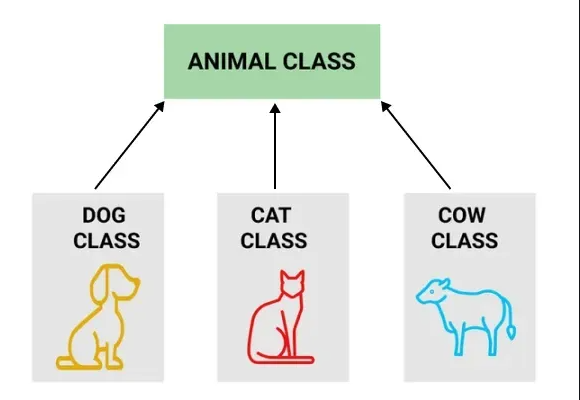

### Cara Implementasi
1. Gunakan kata kunci extends untuk mewarisi dari sebuah class.
2. Subclass dapat mengakses anggota (fields dan methods) yang bersifat protected dan public dari superclass.
3. Subclass dapat mengoverride method dari superclass.
4. Gunakan kata kunci super untuk mengakses anggota superclass.

## Jenis-jenis Inheritance:
### Single Inheritance
Single inheritance terjadi ketika sebuah class turunan hanya mewarisi dari satu class induk. Ini adalah bentuk pewarisan yang paling sederhana, di mana class turunan mendapatkan semua metode dan properti dari satu class induk saja.
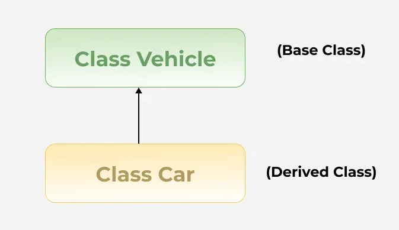

#### Contoh:
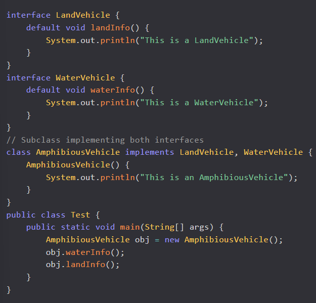

### Hierarchical Inheritance

Hierarchical inheritance terjadi saat beberapa class turunan mewarisi dari satu class induk yang sama. Jenis ini sering digunakan untuk mengelompokkan fungsionalitas yang serupa ke dalam satu class induk, sementara memungkinkan variasi dalam class turunan.
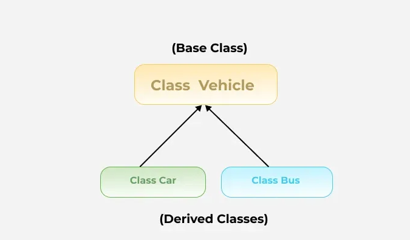
#### Contoh:
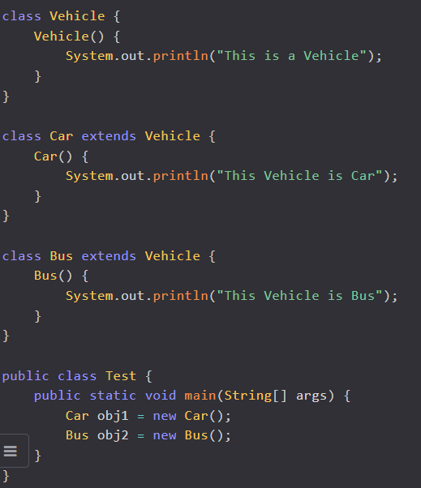
### Multilevel Inheritance
Dalam multilevel inheritance, sebuah class turunan mewarisi dari class turunan lain, sementara class yang sendiri mewarisi dari class induk. Jenis ini menciptakan "rantai" pewarisan. Misalnya, class C mewarisi dari class B, dan class B mewarisi dari class A.
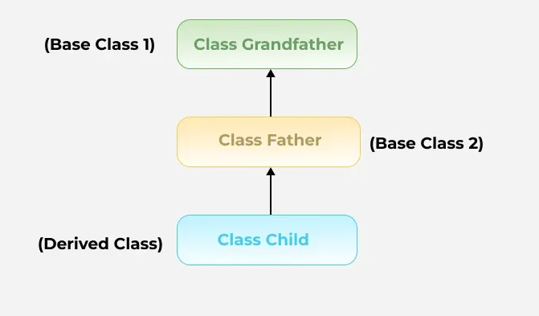
#### Contoh:
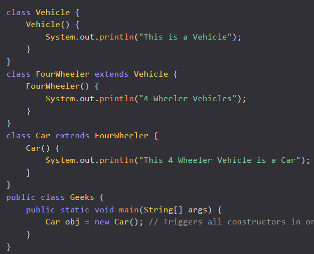
### Hybrid Inheritance
Hybrid inheritance adalah kombinasi dari dua atau lebih jenis inheritance yang sebelumnya sudah disebutkan di atas. Kondisi ini sering terjadi dalam sistem yang lebih kompleks, di mana berbagai bentuk inheritance dipakai bersama-sama untuk mencapai fleksibilitas dan efisiensi yang diinginkan.
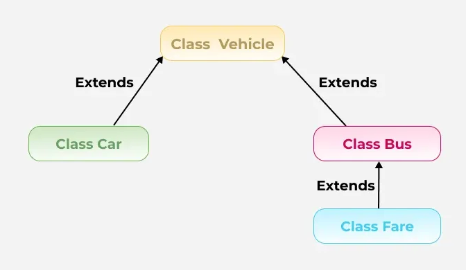

## Praktikum 1: Memahami Single Inheritance
### Tujuan:
Memahami konsep dan implementasi single inheritance.
### Langkah-langkah:
1. Buat sebuah package baru di dalam package modul_6 dengan nama praktikum_1
2. Buat class Person sebagai superclass:
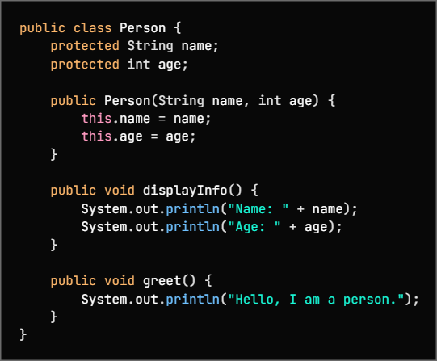
3. Buat class Student sebagai subclass yang mewarisi Person:
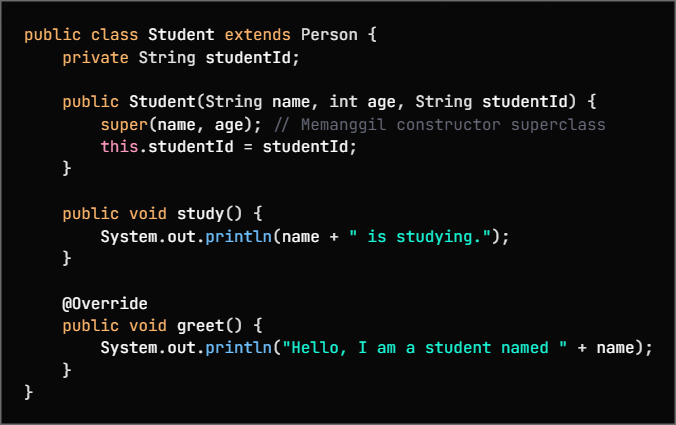
4. Buat class InheritanceTest untuk testing:
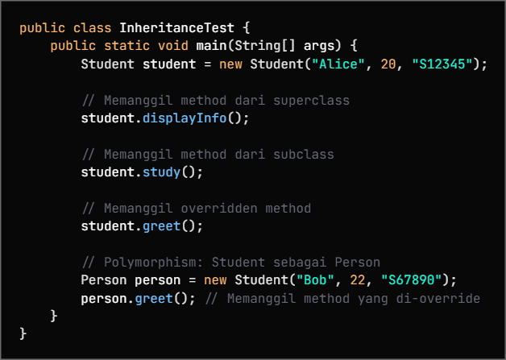
5. Jalankan program dan amati hasilnya
6. Perhatikan bagaimana subclass mewarisi dan memperluas fungsionalitas superclass

## Praktikum 2: Method Overriding dan Kata Kunci super
### Teori Dasar
Method overriding memungkinkan subclass memberikan implementasi spesifik untuk method yang sudah didefinisikan di superclass. Kata kunci super digunakan untuk mengakses anggota superclass.
### Aturan Method Overriding:

1. Method harus memiliki nama dan parameter yang sama
2. Return type harus sama atau subtype (covariant return type)
3. Access modifier tidak boleh lebih restriktif
4. Tidak bisa override method yang final atau static

### Penggunaan super:

1. super() - Memanggil constructor superclass
2. super.methodName() - Memanggil method superclass
3. super.variableName - Mengakses variable superclass

#### Tujuan:

Memahami cara melakukan method overriding dan penggunaan kata kunci super.

#### Langkah-langkah:
1. Buat sebuah package baru di dalam package modul_6 dengan nama praktikum_2
2. Buat class Vehicle sebagai superclass:
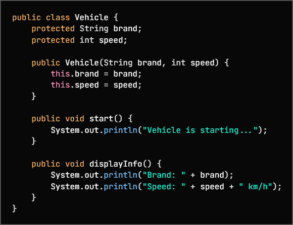
3. Buat class Car sebagai subclass yang mewarisi Vehicle:
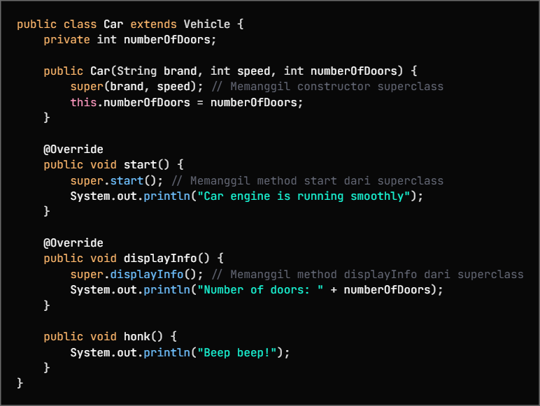
4. Buat class OverrideTest untuk testing:
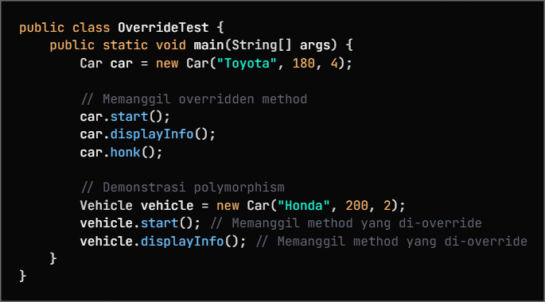
5. Jalankan program dan amati:
Cara method overriding bekerja
   
Penggunaan kata kunci super untuk mengakses superclass

Konsep polymorphism dalam inheritance

## Praktikum 3: Multilevel dan Hierarchical Inheritance
#### Tujuan:
Memahami konsep multilevel dan hierarchical inheritance.

#### Langkah-langkah:
1. Buat sebuah package baru di dalam package modul_6 dengan nama praktikum_3
2. Buat class Animal sebagai superclass:
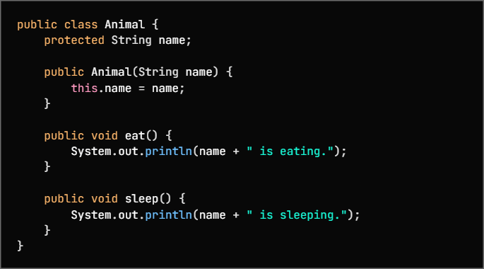
3. Buat class Mammal yang mewarisi Animal (multilevel inheritance):
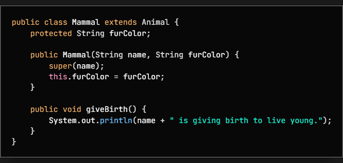
4. Buat class Dog yang mewarisi Mammal (multilevel inheritance):
5. Buat class Cat yang mewarisi Mammal (hierarchical inheritance):
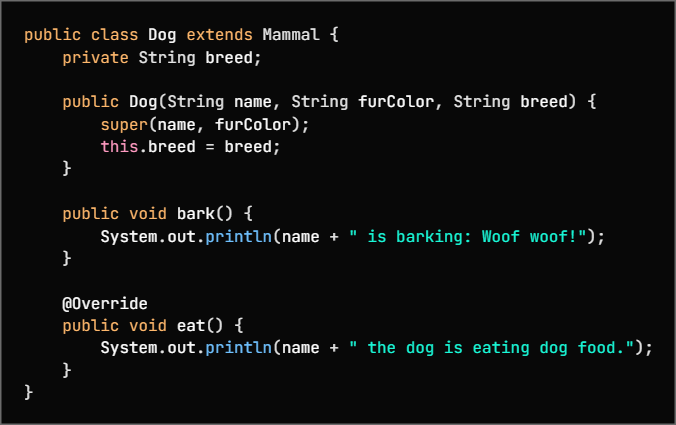
6. Buat class InheritanceTypeTest untuk testing:
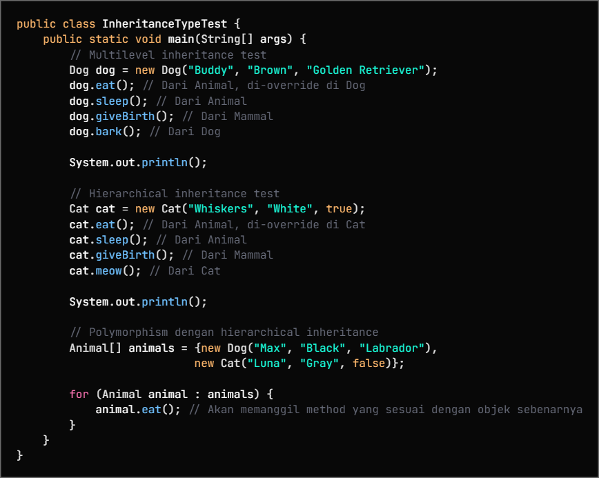
7. Jalankan program dan amati:

Cara multilevel inheritance membentuk rantai pewarisan.

Cara hierarchical inheritance memungkinkan multiple class mewarisi dari satu superclass.
   
Polymorphism bekerja dengan inheritance hierarchy.

## Praktikum 4: Sistem Manajemen Perpustakaan Sederhana
#### Tujuan:
Menerapkan konsep inheritance dalam project real-world sederhana untuk mengelola sistem perpustakaan.

#### Deskripsi Project:
Kita akan membuat sistem manajemen perpustakaan sederhana yang memiliki berbagai jenis item (buku, majalah, DVD) dengan karakteristik yang berbeda namun memiliki beberapa kesamaan.

#### Langkah-langkah:
1. Buat sebuah package baru di dalam package modul_6 dengan nama praktikum_4
2. Buat class LibraryItem sebagai superclass:
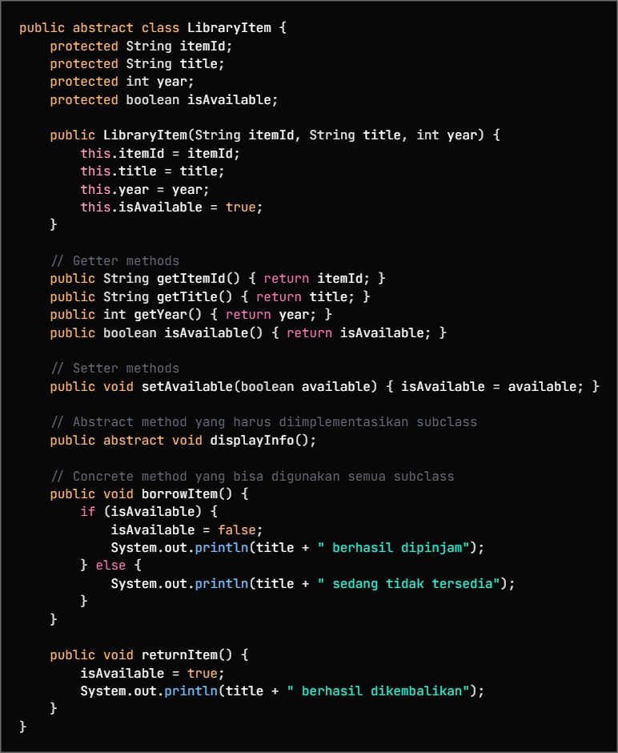
3. Buat class Book yang mewarisi LibraryItem:
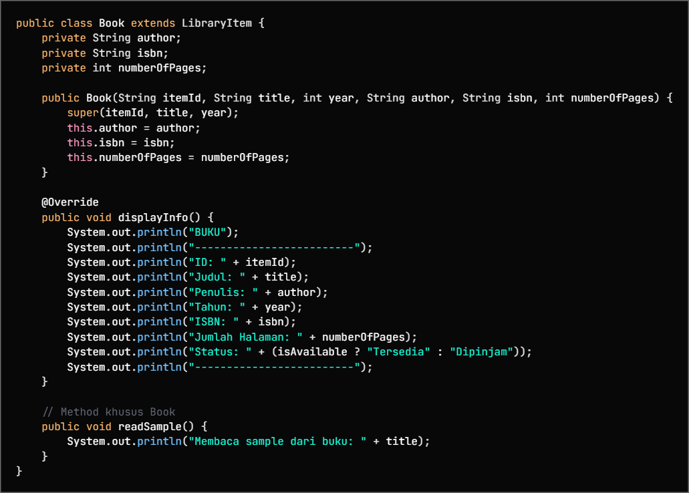
4. Buat class Magazine yang mewarisi LibraryItem:
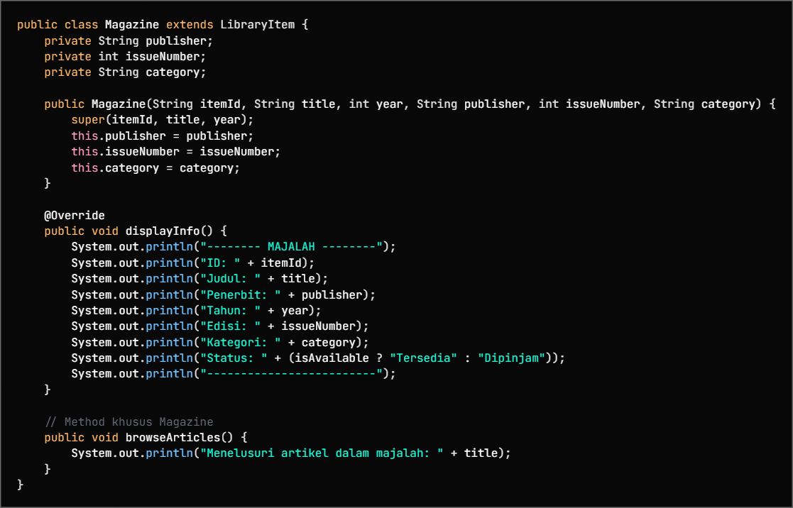
5. Buat class DVD yang mewarisi LibraryItem:
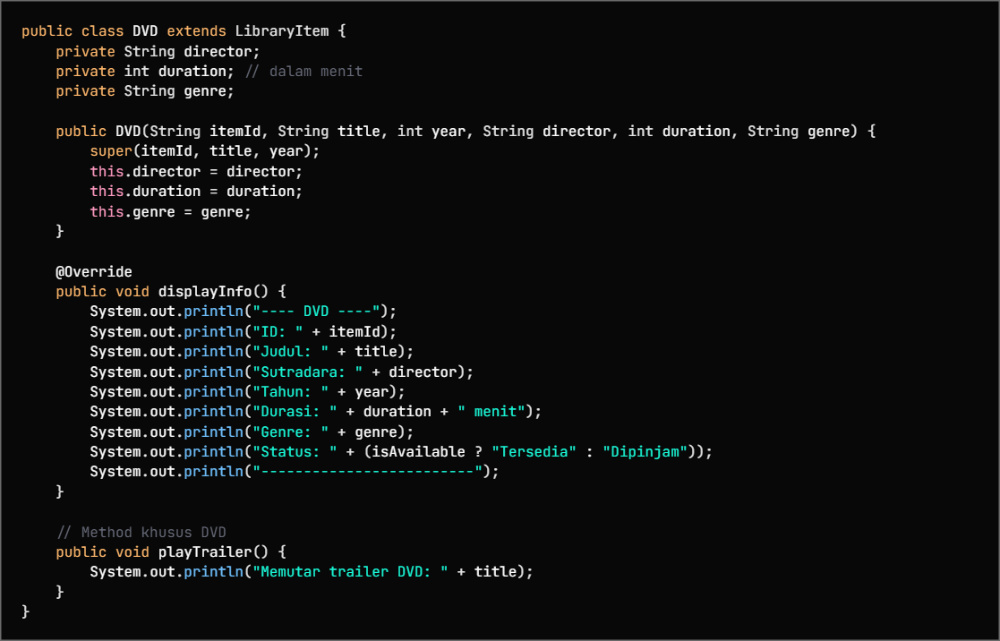
6. Buat class LibraryManagementSystem sebagai main class:
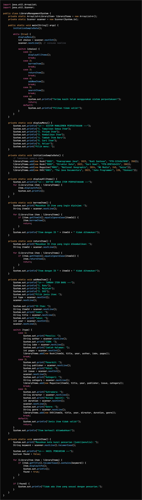
7. Jalankan program dan uji semua fitur:

Menampilkan semua item

Meminjam dan mengembalikan item
   
Menambah item baru
   
Mencari item berdasarkan kata kunci
