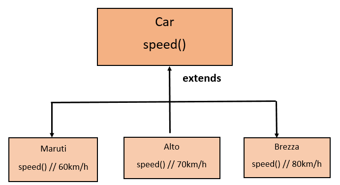
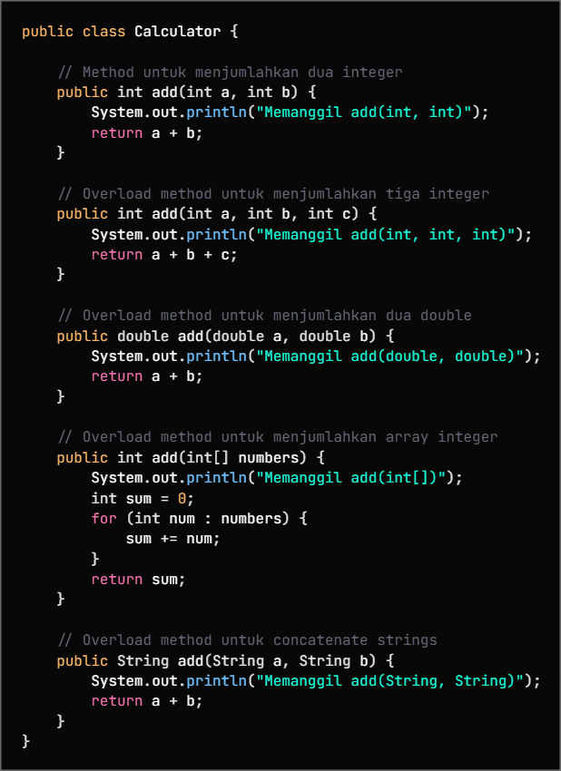
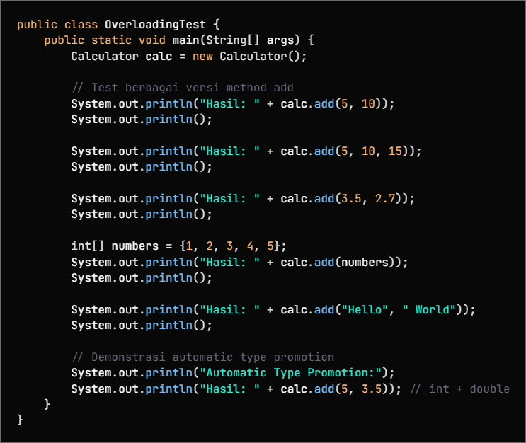
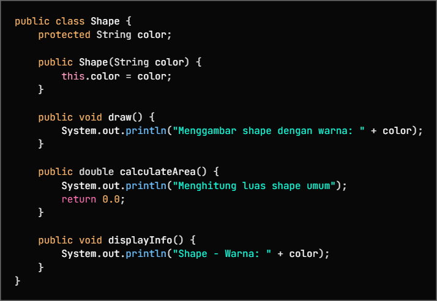
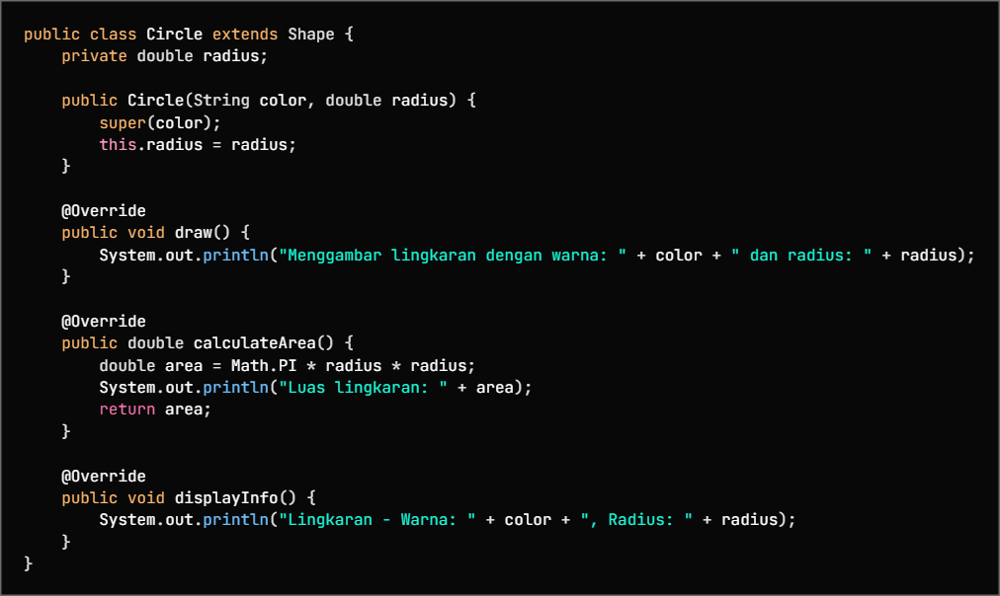
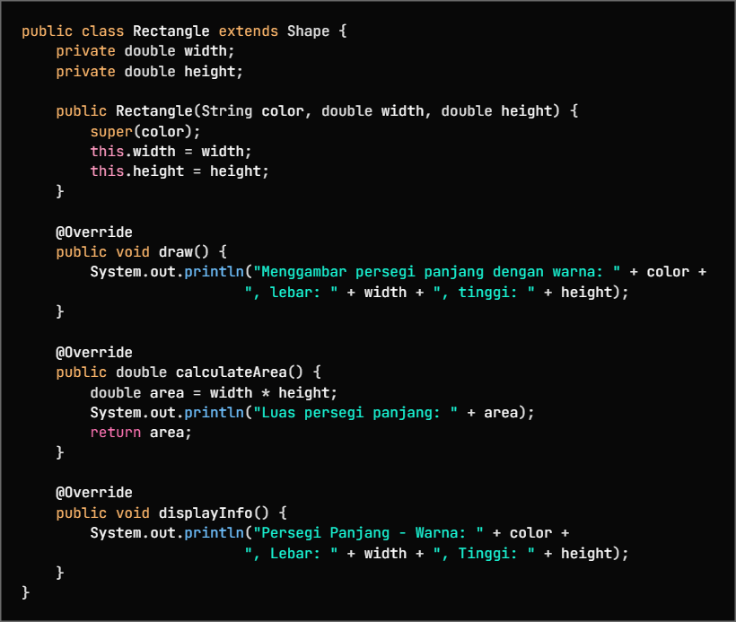
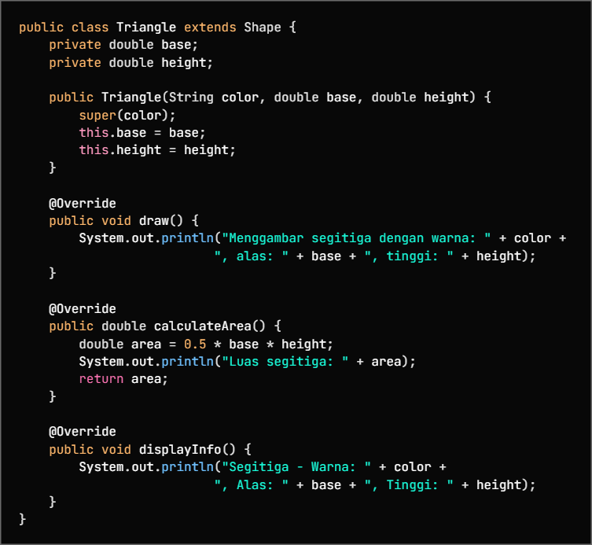
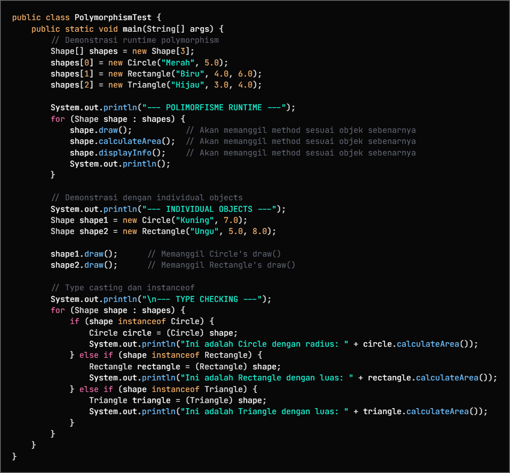

# LAPORAN PRAKTIKUM
## Modul 7 – Polymorphism

#### Mata Kuliah: Pemrograman Berorientasi Objek

### I. Tujuan Praktikum

1. Memahami konsep Polymorphism dalam OOP.

2. Memahami perbedaan method overloading (compile-time polymorphism) dan method overriding (runtime polymorphism).

3. Mengimplementasikan polymorphism menggunakan Java.

4. Menggunakan instanceof untuk pengecekan tipe objek.

### II. Dasar Teori

Polymorphism adalah konsep dalam OOP yang memungkinkan sebuah method memiliki banyak bentuk. Polymorphism memungkinkan objek dari kelas yang berbeda untuk merespons method yang sama dengan cara yang berbeda.

#### Jenis polymorphism:

1. Compile-time Polymorphism (Method Overloading)
Terjadi ketika beberapa method memiliki nama yang sama tetapi berbeda parameter.

2. Runtime Polymorphism (Method Overriding)
Terjadi ketika subclass menimpa method milik superclass dengan implementasi yang berbeda.

#### Keuntungan polymorphism:

1. Fleksibel

2. Mengurangi duplikasi kode

3. Mudah dikembangkan

4. Perilaku dinamis saat runtime

### III. Alat dan Bahan

1. Laptop/PC

2. Sistem Operasi Windows

3. Java Development Kit (JDK)

4. Text Editor / IDE (NetBeans / IntelliJ / VS Code)

### IV. Langkah Kerja
#### A. Persiapan Package

Membuat package utama:

src/modul_7

Lalu membuat sub-package:

modul_7/praktikum_1
modul_7/praktikum_2

#### B. Praktikum 1 – Method Overloading
1. Source Code Calculator.java

2. Source Code OverloadingTest.java

3. Buat class OverloadingTest untuk testing:

4. Jalankan program dan amati hasilnya

Percobaan

        Output Praktikum 1
        Tambah 2 int: 30  
        Tambah 3 int: 60  
        Tambah 2 double: 8.0
 
#### C. Praktikum 2 – Method Overriding
1. Source Code Shape.java

2. Source Code Circle.java

3. Source Code Rectangle.java

4. Source Code Triangle.java

5. Source Code PolymorphismTest.java

6. Jalankan program dan lihat hasilnya

Output Praktikum 2

    Menggambar lingkaran (Circle).  
    Menggambar persegi panjang (Rectangle).  
    Menggambar segitiga (Triangle).  
    s1 adalah objek Circle  
    s2 adalah objek Rectangle  
    s3 adalah objek Triangle

VI. Pembahasan

Pada praktikum ini, method overloading ditentukan saat proses kompilasi berdasarkan perbedaan parameter. Sedangkan method overriding ditentukan saat program dijalankan berdasarkan tipe objek sebenarnya.

Penggunaan instanceof memungkinkan pengecekan tipe objek secara aman saat runtime.

VII. Kesimpulan

Polymorphism memungkinkan method memiliki banyak bentuk.

Overloading bekerja saat compile-time.

Overriding bekerja saat runtime.

Polymorphism meningkatkan fleksibilitas dan efisiensi kode program.

VIII. Saran

Pemahaman polymorphism sebaiknya dipraktikkan bersama konsep inheritance dan encapsulation agar pemahaman OOP lebih optimal.